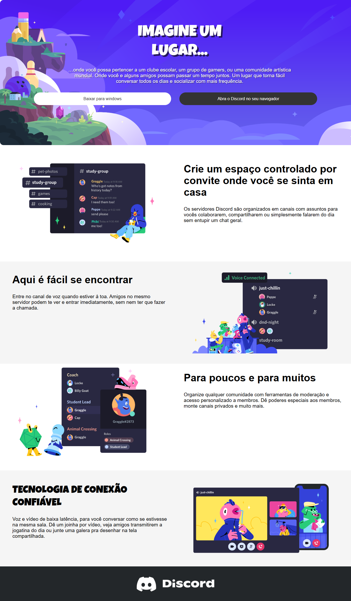
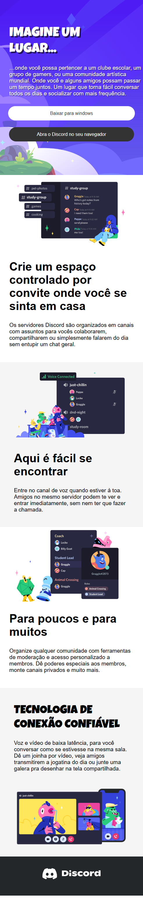

# 📌Clone Responsivo do Site da Discord
O projeto é um clone do site da Discord, com o intuito de reproduzir responsividade utilizando media queries , aplicando os temas abordados ao longo das aulas de CSS da plataforma da Dio
 
 
Desenvolvido e rigorosamente testado no navegador Microsoft Edge.
 

 
 
 
 

 

 

## 📎 **Sumário**
- ⭐ Features
- 📂 Temas abordados
- 🏆 Desafio
- 💻 Demonstração
- 🙋🏻‍♂️ Autor

 

## ⭐ **Features**

- Header
- Botões
- Section
- Rodapé 
- UI Responsiva

*As features são visuais, não possuindo integração com nenhuma API. O intuito do projeto é reproduzir a interface do site original, com algumas modificações.*

 

## 📂 Temas abordados

Recursos CSS presentes no projeto:

- Flexbox
- Media queries 

 

## 🏆 Desafio
Aplicar os conceitos aprendidos em CSS, utilizando Flexbox, Media Queries , design responsivo.

 

## 💻 Demonstração
Você pode acessar ao resultado final do projeto <a href="https://www.figma.com/design/NRBYrG5d4DSzObv7dpTqoM/Desafio-Responsividade---DIO?node-id=0-1&node-type=CANVAS&t=FAelBP4FdHm901hW-0">Clicando aqui</a>.

 

## 🙋🏻‍♂️ Autor

Willian Matheus